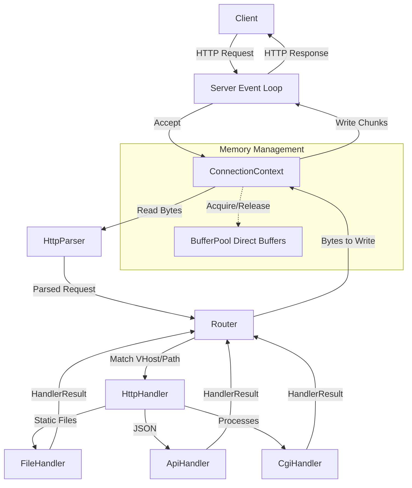

# Architecture Explanation: High-Performance Java NIO Server

This document provides a detailed, method-by-method explanation of the custom Java HTTP/1.1 server. It breaks down the architecture into its core components, explaining the "why" behind key design decisions, especially regarding performance and non-blocking I/O.

## High-Level Architecture

---

## 1. Bootstrapping & Configuration

### `Main.java`
- `main(String[] args)`: The entry point. It simply loads the `config.json` path (from args or defaults) and passes it to `ConfigLoader`. Once loaded, it instantiates the `Server` and calls `start()`. 
  - **Why:** Keeps the entry point clean and decouples configuration loading from the server runtime.

### `ConfigLoader.java`
- `loadConfig(String path)`: Reads the entire JSON file into memory and triggers the custom parser.
- `parseJson(String json)` / `JsonParser`: A custom, lightweight recursive-descent JSON parser.
  - **Why:** The specification required a custom server without external dependencies (like Jackson or Gson). Building a mini tokenizer/parser allows us to handle the complex `server` and `vhosts` nested arrays cleanly without resorting to messy string-splitting hacks.
- `mapToAppConfig(Map<String, Object> map)`: Casts the generic JSON map into our strictly typed `AppConfig`, `VHostConfig`, and `RouteConfig` objects.

---

## 2. The Core Event Loop (`Server.java`)

The `Server` class is the beating heart of the application. It uses Java NIO (New I/O) to handle hundreds of concurrent connections on a single thread without blocking.

- `setupServers()`: Iterates through `config.server.ports` and opens a `ServerSocketChannel` for each. It binds them to `0.0.0.0` and registers them with the `Selector` for `OP_ACCEPT`.
  - **Why:** A single `Selector` can monitor multiple server sockets simultaneously. This allows one thread to listen on port 80, 443, and 8080 at the same time.

- `start()`: An infinite `while(true)` loop. It calls `selector.select(100)` to wait for network events (with a 100ms timeout). When an event occurs, it iterates through `selectedKeys()` and routes them to `handleAccept`, `handleRead`, or `handleWrite`.
  - **Why:** The 100ms timeout ensures the loop doesn't block forever if no network events happen. This gives the server a chance to run background tasks (like the Reaper).

- `checkProcesses()` (The Reaper): Iterates through all registered keys. If a connection hasn't had activity in `keepAliveTimeoutMs`, it closes it. It also checks if async CGI processes have finished.
  - **Why:** Prevents "Slowloris" attacks and dead connections from holding socket file descriptors forever.

- `handleAccept(SelectionKey key)`: Accepts the incoming TCP connection, configures the `SocketChannel` as non-blocking, creates a `ConnectionContext` to track its state, and registers it for `OP_READ`.

- `handleRead(SelectionKey key)`: Reads bytes from the socket into the context's direct `readBuffer`. Passes the buffer to `HttpParser`. If the parser finishes (`State.DONE`), it triggers the `Router` and sets the key to `OP_WRITE`.
  - **Why:** Non-blocking reads mean we might only get half an HTTP request in one go. The `HttpParser` maintains state so we can pick up where we left off on the next loop iteration.

- `handleWrite(SelectionKey key)`: Writes bytes back to the client. It calls `context.prepareNextWriteChunk()` to handle large responses in pieces. Once completely written, it checks the `Connection: close` header to either close the socket or keep it alive for the next request.

---

## 3. Memory Management

### `BufferPool.java`
- `get()` / `release()`: Manages a pool (`ArrayDeque`) of `ByteBuffer.allocateDirect()`. 
  - **Why:** Direct ByteBuffers live outside the standard Java Heap. This means the OS can write network data directly into them without the JVM having to copy the data from heap space to native space. Pooling them prevents the JVM from constantly garbage-collecting short-lived buffers, drastically reducing latency and GC pauses.

### `ConnectionContext.java`
- Tracks the state of a single TCP connection (`lastActivityTime`, `parser`, `readBuffer`, `writeBuffer`).
- `setResponse(byte[] response)` & `prepareNextWriteChunk()`: Instead of wrapping a massive 50MB file into a single ByteBuffer, the context slices the byte array into smaller chunks (e.g., 8KB) that fit into the direct `writeBuffer`.
  - **Why:** This enforces **Backpressure**. If the client is downloading slowly, `channel.write()` will write exactly what the network can handle, and the server will yield back to the event loop. This prevents `OutOfMemory` errors when serving large files.

---

## 4. Parsing and Security Guardrails

### `HttpParser.java`
- A state-machine parser (`REQUEST_LINE`, `HEADERS`, `BODY`). 
- `parse(ByteBuffer data)`: Reads character by character. If it encounters a newline, it transitions states.
- **Security Guardrails:** It increments `bytesReadForHeaders` for every character. If this exceeds `config.server.maxHeaderSize`, it immediately drops the connection. Similarly, it checks the `Content-Length` header against `config.server.maxBodySize`.
  - **Why:** Protects the server from Buffer Overflow and Denial of Service (DoS) attacks where malicious clients send infinitely long headers.

### `HttpRequest.java`
- Holds the parsed HTTP data (Method, Path, Headers, Body).
- `setPath(String path)`: Parses query parameters.
- **Path Sanitization:** Explicitly checks for `../` (directory traversal attempts) and `\0` (null-byte injection). Throws an exception if found.
  - **Why:** Prevents an attacker from requesting `GET /../../../../etc/passwd` to read secure server files.

---

## 5. Routing and Execution

### `Router.java`
- `handle(HttpRequest request)`: 
  1. Parses the `Cookie` header to manage sessions via `SessionManager`.
  2. Extracts the `Host` header (e.g., `localhost` vs `example.com`).
  3. Finds the matching `VHostConfig` based on the Host header.
  4. Finds the longest matching `RouteConfig` (e.g., `/api/v1` matches better than `/`).
  5. Instantiates the correct `HttpHandler` and calls it.

### `HttpHandler.java` (Interface)
- Enforces a unified standard: `HandlerResult handle(request, vhost, route)`.

### The Handlers
- **`ApiHandler.java`**: A simple dynamic handler that crafts a JSON response on the fly.
- **`FileHandler.java`**: Maps the URL path to the local filesystem using `vhost.root`. If the path is a directory, it checks `allowDirectoryListing` to either generate an HTML index or return a 403 Forbidden. It guesses `Content-Type` based on file extensions.
- **`CgiHandler.java`**: Spawns a physical OS process (like a Python script) using `ProcessBuilder`, passing HTTP headers as `HTTP_*` environment variables, and returning a `CGIResult` so the `Server` can monitor the process asynchronously.
